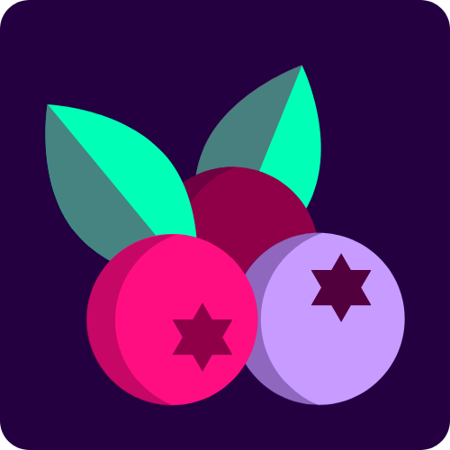

<h1>Wildberries</h1>
<h2>An experimental dark color theme for people who love purple</h2>

| Palette        | Hex       | RGB           | HSL                 | 🎨                                                                           |
| -------------- | --------- | ------------- | ------------------- | ---------------------------------------------------------------------------- |
| Background     | `#19002E` | `25 00 46`    | `272.6° 100% 9%`    |      |
| Background 2   | `#240041` | `36 00 65`    | `273.2° 100% 12.7%` |    |
| Primary Button | `#900048` | `144 00 72`   | `330° 100% 28.2%`   |  |
| Green          | `#00ffb7` | `0 255 183`   | `163.1° 100% 50%`   |           |
| Orange         | `#ff4500` | `250 141 62`  | `25.2° 94.9% 61.2%` |          |
| Pink           | `#ff0e82` | `255 14 130`  | `331.1° 100% 52.7%` |            |
| Purple         | `#c79bff` | `199 155 255` | `266.4° 100% 80.4%` |          |
| Red            | `#d70040` | `215 0 64`    | `342.1° 100% 42.2%` |             |
| Yellow         | `#ffd700` | `255 215 0`   | `50.6° 100% 50%`    |          |
| Blue           | `#399ee6` | `57 158 230`  | `205° 77.6% 56.3%`  |            |

<!-- alternative for purple: #a470d8 -->
<!-- Another interesting purple: #ac4ea4 -->
